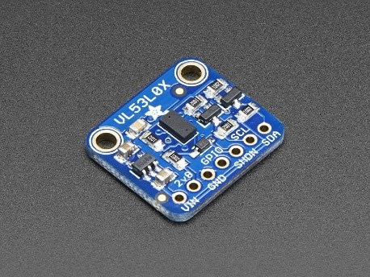

# Bluetooth Autonomous Robot
Autonomous Robot designed with Bluetooth Control

Built by Denis Petrov, Karthik Paladugula, and Sudeep Annem for ECE 4180
# Overview

We set out to design and build a mobile robot that is configured for obstacle avoidance utilizing LIDAR and sonar sensing technology. The system can support user control via Bluetooth as well as autonomous operation. While in motion, the robot utilizes the sonar to detect objects directly in front of it, as well as the servo-mounted LIDAR sensor to detect objects in a wider field of view.

# Design Description

## Parts List
* mbed LPC1768

* HCSR04 Sonar Sensor

* VL53L0X LIDAR TOF Sensor

* RC Servo

* TB6612FNG Sparkfun Dual H-Bridge Breakout Board

* 2x DG01D 48:1 DC Motor

* Adafruit BLuetooth LE UART Friend

## Hardware 
The obstacle avoidance feature implementation consisted of mounting a VL53L0X, a LIDAR sensor, on a rotational servo and attaching a HC-SR04 40 kHz ultrasonic sensor to the front of the vehicle for immediate collision prevention. For Bluetooth functionality we employed the ADAfruit Bluetooth Low Energy UART Friend to control system autonomy via an external controller. The systems center of operations relies on the Mbed LPC1768 running Mbed RTOS operations.

## Software
For code reference, see main.cpp. The build was developed in C++ and compiled on the Mbed online interface. We utilized the Motor, HC_SR04_Ultransonic, Mbed, and Mbed-RTOS libraries.

The software includes several RTOS threads which individually control the sonar reading, lidar reading, servo rotation, control input from bluetooth, and motor control.

### Bluetooth Thread
The Bluetooth Thread manages the motor speed based on user input from the Bluetooth App via the UART Friend. It also manages the flag that puts the robot in and out of autonomous mode and prevents user directional control input from interfering with the autonomous navigation.

### Servo Thread
The Servo Thread directly controls the servo by manipulating the PWM pulsewidth sent to it. This thread also incorporates a state machine that cycles through the servo positions. This results in a sweeping motion that pauses at specific intervals to allow the lidar sensor to get a few pings off before moving to the next position.

### Sonar Thread
The Sonar Thread manages the trigger and echo signals needed to recieve data from the sonar. It sets the sonar specific detection flag if the sonar detects something within a defined threshold so that the main thread knows to take over control of the robot.

### Lidar Thread
The Lidar thread manages data from the lidar and the detection flag similar to the sonar thread.

### Main Thread
The Main Thread manages motor control in the case that the sensors have detected something within their thresholds. If the sonar flag is high, then the main thread forces the robot to move backwards and turn to the right to avoid collision. If the lidar flag is high, then the main thread forces the robot to turn. This turn amount and direction is dependent on the state of the servo when the flag was set high, so that the robot will turn left if the lidar detect something on the right and vice versa. This thread also manages a flag that locks the motors so that only the main thread can control them during the adjustment phase.

# User Instructions
Download the Adafruit Bluefruit LE Connect app and connect to the Bluefruit module. Select the controller from the menu options. By default the robot will be in user controlled mode. Button 1 turns Autonomous driving on, button 2 turns it off and slows the robot to a stop. When manually controlling the robot, the up arrow moves forwards and down arrow moves backwards. The left and right arrow execute left or right turns respectively.

# Demo Video
https://youtu.be/sqnAzDQDFpM

# Presentation Video
https://www.youtube.com/watch?v=GTur9lriKEU
